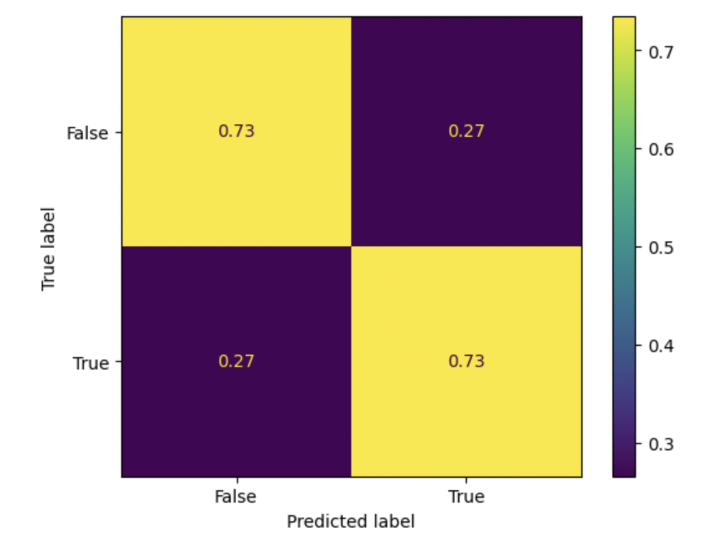

Sebastian Modafferi

### Problem Identification
We will be predicting, at the 15 minute mark, if a League of Legends team wins or loses the game. I chose 15 minutes as the line to draw for a couple of reasons:
 - Tower plates fall at 14 minutes.
  - Tower plates can be a massive source of income in the early game.
  - Tower plates are a representation of the early game laning pressure a team has.
  - Once tower plates fall, laners are more likely to roam since they aren't risking giving up plate gold. This implies a possible change in the tide of the game if a team is playing an efficient roaming composition.
 - You cannot start a surrender vote before 15 minutes
  - If my model is accurate enough, I can feel justified for giving up at 15 minutes since the game is already predicted to be unwinnable. 
 - Some betting platforms allow you to withdraw a bet partway through the game for a penalty.
  - This means that if my model is accurate enough, it opens an avenue for me to abuse this tactic and gain favorable gambling odds. 

##### Model Requirements Details
This is a __binary classification problem__, therefore my model will either classify _win_ or _lose_. My evaluation metric will be accuracy. I chose accuracy because I'm most concerned with knowing the outcome of a game. Other evaluation metrics, such as recall or precision, tailor the score towards accurately predicting a certain outcome more correctly than the other. I am purely interested in accurately modelig __if__ the team will win, and am not concerned that one specific classification may be more accurate than the other. All data used in training and prediction can be collected at the 15 minute mark. This means that if you deployed the model in the real world, it would be able to predict a winner at the 15 minute mark, given you have the necessary numbers on in-game data.

### Baseline Model
#### Features (4 Quantitative, 1 Nominal):
 - Team Kills: Numerical, discrete, this feature was not transformed
 - Team Deaths: Numerical, discrete, this feature was not transformed
 - Team Gold: Numerical, continuous, this feature was standardized
 - Team XP: Numerical, continuous, this feature was standardized
 - Side of the map: Categorical, Nominal, this feature was one-hot-encoded
 - __CLASSIFYING__ Result: whether or not the team we are using data from won or not. __Categorical, Ordinal__.
 - _You can see a snippet of our _X_ before the transformations below._

|        |   killsat15 |   deathsat15 |   goldat15 |   xpat15 | blueside   |
|-------:|------------:|-------------:|-----------:|---------:|:-----------|
|  31979 |           1 |            2 |      23290 |    29899 | False      |
| 118583 |           5 |            1 |      25712 |    31150 | False      |
|  14854 |           4 |            2 |      23329 |    29040 | True       |
| 108263 |           3 |            4 |      23387 |    28318 | False      |
| 108922 |           4 |            7 |      27624 |    30704 | True       |

#### Discussion
The baseline model was a Support Vector Classifer. I chose this model because of it's ability to work well in high dimensions. I knew that there were tons of features I'd end up throwing into the model, and I was afraid that the wrong model would suffer from the _curse of dimensionality_.  This model, on the default parameters, achieved a test accuracy of 72.99%, and a training accuracy of 72.28%. This was a decent result, and suggested that the model was already very effective at making predictions. I believe this is because XP and Gold are sort of all-encompassing representations of a team's performance. This being said, I was still curious about how accurate I could get the model with these simple metrics. I decided to run a __grid-search__ to hypertune the `C` parameter. It only raised the accuracy by 1%. Since this isn't a noticeable increase, and is likely just due to a different fitting to noise, I decided to leave my baseline model with the default parameter of `C=1`. In totality, I believe that this is a __good__ model. It truly testifies to how impactful a few seemingly simple features can be.

### Final Model

__Note:__ In preparation for this model, I wanted to one-hot encode the champions that a team had. This meant combining data from the two DataFrames, and resulted in a new train-test split. The accuracies you see above in __Baseline Model__ are from the new split.

##### Features (4 Quantitative Continuous, 5 Quantitative Discrete, 6 Categorical Nominal):
 - __`'goldat15'`__: The amount of gold collected by the team at 15 minutes. __Numerical, Continuous, Standardized.__
 - __`'xpat15'`__: The amount of xp collected by the team at 15 minutes. __Numerical, Continuous, Standardized.__
 - __`'killsat15'`__: The amount of kills the team has at 15 minutes. __Numerical, Discrete, Raw.__
 - __`'deathsat15'`__: The amount of deaths the team has at 15 minutes. __Numerical, Discrete, Raw.__
 - __`'opp_goldat15'`__: The amount of gold collected by the opposing team at 15 minutes. __Numerical, Continuous, Standardized.__
 - __`'opp_xpat15'`__: The amount of xp collected by the opposing team at 15 minutes. __Numerical, Continuous, Standardized.__
 - __`'opp_killsat15'`__: The amount of kills the opposing team has at 15 minutes. __Numerical, Discrete, Raw.__
 - __`'opp_deathsat15'`__: The amount of deaths the opposing team has at 15 minutes. __Numerical, Discrete, Raw.__
 - __`'turretplates'`__: The amount of turret plates a team has destroyed. __Numerical, Discrete, Raw.__
 - __`'top'`__: The champion playing top for the team. __Categorical, Nominal, One-Hot-Encoded.__
 - __`'jg'`__: The champion playing jungle for the team. __Categorical, Nominal, One-Hot-Encoded.__
 - __`'mid'`__: The champion playing middle for the team. __Categorical, Nominal, One-Hot-Encoded.__
 - __`'bot'`__: The champion playing bot for the team. __Categorical, Nominal, One-Hot-Encoded.__
 - __`'sup'`__: The champion playing support for the teame. __Categorical, Nominal, One-Hot-Encoded.__
 - __`'blueside'`__: Determines if the team is playing from blueside. __Categoriacl, Nominal, Raw (One-Hot-Encoded).__
 - __CLASSIFYING__ Result: whether or not the team we are using data from won or not. __Categorical, Ordinal__.
 - _You can see a snippet of our _X_ before the transformations below._

|    |   opp_goldat15 |   opp_xpat15 |   opp_killsat15 |   opp_deathsat15 | top       | jg       | mid      | bot      | sup     |   goldat15 |   xpat15 |   killsat15 |   deathsat15 | blueside   |   turretplates |
|---:|---------------:|-------------:|----------------:|-----------------:|:----------|:---------|:---------|:---------|:--------|-----------:|---------:|------------:|-------------:|:-----------|---------------:|
|  0 |          24699 |        29618 |               6 |                5 | Renekton  | Xin Zhao | LeBlanc  | Samira   | Leona   |      24806 |    28001 |           5 |            6 | True       |              5 |
|  1 |          24806 |        28001 |               5 |                6 | Gragas    | Viego    | Viktor   | Jinx     | Alistar |      24699 |    29618 |           6 |            5 | False      |              0 |
|  2 |          25285 |        29754 |               3 |                1 | Gragas    | Lee Sin  | Orianna  | Jhin     | Rakan   |      23522 |    28848 |           1 |            3 | True       |              2 |
|  3 |          23522 |        28848 |               1 |                3 | Gangplank | Nidalee  | Renekton | Syndra   | Leona   |      25285 |    29754 |           3 |            1 | False      |              3 |
|  4 |          23604 |        29044 |               1 |                3 | Renekton  | Talon    | Zoe      | Aphelios | Yuumi   |      24795 |    31342 |           3 |            1 | True       |              1 |

##### Feature Discussion

I chose to add the features on opponent data beause I believe it would give more insight into how well the team was performing. It would allow the model to understand more about the difference in team strength. For example if a game had a level 1 invade, and resulted in a spiral of high-action gameplay with many deaths/kills early in the game, the model would understand that __both__ teams have high kills. This allows for a more nuanced expression of metrics like gold and exp. Adding the champion data allows for the model to account for comps which may be hyperscalers. For example, if a team has Kayle and Veigar, they may be down gold in the early game. However, the model should understand that sometimes it is __expected__ for a champion or team composition to be weak earlier in the match, with the guarentee of becoming incredibly strong if the game goes on long enough. In situations like this, it may be more acceptable to allow for a larger difference in our other metrics between teams. Finally, I added data on the tower plates collected on a team. I covered why this can be impactful in the introduction, but to briefly summarize: tower plates are effectively representations of how much pressure was exerted on lanes through the first 14 minutes. They are a way of showing early game lane advantages even if cs and exp are similar.     

##### SVC Model

The first model trained on this new dataset was another __SVC__ model. It achieved a __train accuracy__ of 75.88% and a __test accuracy__ of 75.11%. While this is marginally better than the last, I was not satisfied with such a small increase. However, I reasoned that since my model was trying to predict what would happen over the course of a game purely based off of the first 15 minutes, a high accuracy would likely represent over fitting. To expand on this, League of Legends is a game where despite the lead a team has, if they begin to perform poorly it opens the possibility of the losing team taking the lead. Additionally, as discussed before, certain team compositions are expected to fall behind early game, with the understanding that they scale better into the late game. These unknowable possibilites makes it so that a model with an accuracy of, for example, 98% would be overfit to the data. The reality is, my model __should__ have a degree of uncercainty, because no League of Legends game is ever determined until one team wins. Despite this, I still wanted to examine performance with another model.    
     
The next model I trained on this data was a __Random Forest Classifier__. It had a similar test accuracy (74.81%), however it's train accuracy was 100%. This is because I initially trained this model with default hyperparameters. Random Forest, if not bounded, will always attempt to perfectly fit the data. The reason it was able to do so with my data is because of the one-hot encoding of the champions. Across 21000 games, it is already rare for the same team composition to be chosen twice, and furthermore practically impossible for a game to have the same team composition __and__ nearly identical aggregrate performances at 15 minutes. These two traits of the data allow the RFC to perfectly 'bin' each observation. Obviously, a training accuracy of 100% is not acceptable since we need the ability to generalize to unseen data. To correct for this, I performed a __k-fold grid search__ on the `__max_depth__` hyperparameter. Mean validation accuracy from 4 different folds was examined for 14 different max_depths, for a total of 56 models being trained. This resulted in an __optimal `max_depth` of 30__. This RFC had a mean validation accuracy (similar to train accuracy when performing k-fold validation) of 74.56% and a test accuracy of 74.85%. Despite being _technically_ worse than the new SVC model, I believe the RFC is preferable due to it's low computational complexity and insignificant difference in performace. For those reasons __the RFC was chosen to be my final model__. Also, this model would theoretically be better at predicting the outcome of games with team compositions that are built to scale into lategame, or games where an early lead was only represented primarily through lane pressure. Additionally, it should have a more accurate prediction for games that have extreme observations for categories like kills, gold, or exp (given that the values are roughly equal between each team). This conclusion arises from the previous explanation of the features and why they were added.    
      
### Fairness Analysis

In order to formulate a fairness question, I decided to examine the __confusion matrix__ of my final model.

Looking at this confusion matrix, it appears my model is almost equally accurate for both classifications. This is likely because I am passing in enemy performance data as well. It is very likely that the victor of the game is predicted mainly by which team has a higher gold and exp value.    
     
Unfortunately, the confusion amtrix did not give me any ideas of potential places for bias. However, I was curious if the algorithim is __biased against teams that do not have extreme performances__? In other words, if a team has roughly average exp and gold at 15 minutes, will the algorithim have a lower accuracy? I plotted this initial bar chart to display if this could be a valid claim.   

_note: the numbers are slightly different than my notebook pdf submission, but the conclusion is the same. The difference is due to me having to re-run the file, and a different train-test split being generated._
<iframe src="bias_bars.html" width=800 height=600 frameBorder=0></iframe>

From this, we see a small difference, only about a 7% difference in accuracy. However, due to the amount of data available, there is a decent chance that this is statistically significant, which would suggest that our model __does__ have a bias against teams that perform around average. To find the answer, I've laid out a __permutation test__ as follows:
- __Within range__ definition: A game is __within range__ if the team we are trying to predict has a `'xpat15'` and `'goldat15'` that are both __within__ 0.5 standard deviations of their respective means. These means and standard deviations are measured for the entire dataset, and then applied to our test set for evaluation. 
- Null Hypothesis: The classifier's accuracy is the __same__ for games that are within range and games that are not within range.
- Alternative Hypothesis: The classifier's accuracy is __higher__ for games that are not within range.
- Test statistic: Difference in accuracy: (not within range) - (within range). The signed difference is important because a higher value supports the null hypothesis, if it was unsigned we'd have to change our alternative!
- Significance level: 0.01     
        
The permutation test was then ran for 10,000 shuffles, and the distribution of the simulated test statistic can be seen below:
<iframe src="simulated_hist.html" width=800 height=600 frameBorder=0></iframe>

This gives us a calculated p-value of 0.0024. Since this is less than our signifigance level, we are able to __disprove the null hypothesis__. This suggests that the data we have actually comes from two different distributions. In other words, its very unlikely (less than 1% likely), that our model __doesn't have a bias against teams that are `within_range`__. This means we are more likely to make errors in our predictions if the team we are trying to predict does not overperform or underperform.

 
